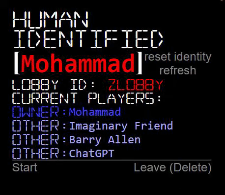

# MilestOWN 2

[See Version 1](https://github.com/moefingers/UNLV-MilestO-W-N) for local multiplayer.

This repository is hopefully the front and backend for MilestOWN 2. More notes will follow.

[Hosted on Render.com!](https://milestown2.onrender.com/)

[And a backup frontend on GitHub Pages](https://moefingers.github.io/milestown2/)

# Index:
- [API Documentation](#backend-api-documentation)
- [Express PeerJS Server Events](#express-peerjs-server-events)
- [Development notes](#development-notes) 
  - [Cross-origin resource sharing](#cross-origin-resource-sharing-cors)
  - [npm scripts](#npm-scripts)
  - [Getting up and running](#getting-up-and-running)
  - [Middlwear](#middlwear)
  - [Culling Lobbies](#culling-lobbies-jsculllobbiesjs)
  - [Other important notes](#other-important-notes)

# Backend API Documentation

# `GET '/'`
### Returns index.html, frontend. \
Format of response: `<!DOCTYPE html>`

# `GET '/*'`
### Returns 404 fragment with link to home.

# `GET '/healthz'`
### Returns `200 OK`

# `GET '/maps'`
### Returns maps.json
Format of response: `[{...}, {name, map, spawns}]`

# `GET '/maps/:nameOrIndex'`
### Returns one map by name or index
Example request by index: `GET /maps/0` \
Example request by name: `GET /maps/4x2` \
Format of response: `{name, map, spawns}`

# `POST '/maps'`
### Store one or many maps
Format of request body (`req.body`) for one map: `{name, map, spawns}` \
Format of request body (`req.body`) for many maps: `[..., {name, map, spawns}]` \
Example and format of **(200 OK)** response: 

    { 
        "message": "here are the results of your post request",
        "mapStatuses": [
            {...},
            {
                "map": "test1",
                "message": "created successfully",
                "link": "<base>/maps/test7" || 
            }
        ]
    }
# `GET '/aesthetics'`
### Get aesthetic data like colors and shapes for players.
Returns aesthetics.json

# `GET '/lobby'`
### Get All Lobbies
Worth noting that each `playerToken` is omitted from the response.\
Example and format of **(200 OK)** response:

      [
            {...},
            {
                lobbyId: asdf
                playerList: [
                    {...},
                    {
                        playerId: asdf,
                        owner: true
                    }
              ]
          }
      ]

# `GET '/lobby/:id'`
### Get One Lobby
Returns one lobby by `lobbyId`\
Worth noting that each `playerToken` is omitted from the response.\
Example and format of **(200 OK)** response:

      {
          lobbyId: asdf
          playerList: [
              {...},
              {
                  playerId: asdf,
                  owner: true
              }
          ]
      }

# `POST '/lobby'`
### Create Lobby
Creates one lobby with `lobbyId` and `playerId` and `playerToken` from request body (`req.body`). \
Format of request body (`req.body`): `{lobbyId, playerId, playerToken}`
Example response:

    {
      "joined": true, 
      "message": "lobby created successfully and joined as owner", 
      "lobbyId": req.body.lobbyId, 
      "playerList": [
        {
          playerId: req.body.playerId, 
          playerToken: req.body.playerToken,
          owner: true
        }
      ]
    }
# `POST '/lobby/join'`
### Join Lobby
Joins one lobby with `lobbyId` with player as `playerId` and `playerToken` from request body (`req.body`). \
Worth noting that each `playerToken` is omitted from the response.\
Also worth noting the response will contain a `joined` boolean to show if the join was successful.\
Format of request body (`req.body`): `{lobbyId, playerId, playerToken}`
Example of successful join response: 

    {
      joined: true,
      message: "joined lobby successfully", 
      lobby: {
        lobbyId: req.body.lobbyId, 
        playerList:  [
          {...},
          {
            playerId: player.playerId, 
            owner: player.owner
          }
        ]
      }
    }
Example of unsuccessful join response:\

    {
      joined: false, 
      message: "Token conflict. Refresh page or change identity."
    }

# `POST '/lobby/leave'`
### Leave Lobby
Leaves one lobby with `lobbyId` with player as `playerId` and `playerToken` from request body (`req.body`). \
Format of request body (`req.body`): `{lobbyId, playerId, playerToken}` \
Example of successful leave response: `{message: 'left lobby'}` \
Example of unsuccessful leave response: `{message: 'Token conflict. Refresh page or change identity.'}`

# `DELETE '/lobby/:id'`
### Delete One Lobby
Deletes one lobby with `lobbyId`, requiring `playerId` and `playerToken` from request body (`req.body`) to verify request. \
Format of request body (`req.body`): `{lobbyId, playerId, playerToken}`
Example of successful delete response: `{inLobby: false, message: 'lobby deleted'}` \
Example of unsuccessful delete response: `{inLobby: false, message: 'lobby not found'}`

# `DELETE '/lobby/all'` 
### Delete All Lobbies
Deletes all lobbies. \
Expects `req.body.confirm` == `true`

# Express PeerJS Server Events 
[(npm link)](https://www.npmjs.com/package/peer)`import {ExpressPeerServer} from 'peer'`
## `peerServer.on('connection',...)`
Lobbies will be culled for peers that are not in peerlist and empty lobbies.

## `peerServer.on('disconnect',...)`
Client will be removed from all lobbies. \
Lobbies will be culled for peers that are not in peerlist and empty lobbies.

# Development notes:
## cross-origin resource sharing (cors)
### in `development` environment, `cors origin` is set to `*`
### in `production` environment, `cors origin` is set to `[...definedOrigins]`

## `npm` scripts
### `npm run deploy` in either `/frontend` or `/` directory will do the following:

- **Do not run these commands**, these are not instructions.
- This is a description of what running `npm run deploy` does.
- *temporarily* add `base: '/milestown2/'` to vite.config.js
- run `npm run build`
- run `npm run gh-pages -d dist`
- remove `base: '/milestown2/'` from vite.config.js
- run `npm run build` (without base in vite.config.js)
- delete `backend/dist`
- copy `frontend/dist` to `backend/dist` (so the host will read commits from the build)

## Getting up and running:
- `npm install` in main directory will install dependencies in BOTH frontend and backend
- `npm run frontend` in main directory will run the vite app with live changes.
- `npm run preview` in main directory will build and run the vite app locally in a production-style environment.

- `npm run backend` in main directory will run the backend app in a production-style environment.
- `npm run backendpreview` in main directory will run the backend with `nodemon`.

## Middlwear
- All requests will be intercepted and logged to console.
- All requests except to `/peerjs/peers` will trigger a culling.

## Culling Lobbies `js/cullLobbies.js`
- `js/cullLobbies.js` is a script that will be run in the backend. It will cull lobbies that have no peers in the peerlist by retreiving the peerlist and then checking through the lobbies.

## Other important notes:
- Please use localhost for development cors to work propery. I'd include 127.0.0.1 but it's not necessary and I don't think it's appropriate to dedicate many lines of code to simply accept multiple local addresses unrelated to production.

The rough outline is to have a...

- backend - exploring render? - for now db will be stored on server
  - serving data like maps, levels, pickups
  - hosting games
  - accepting and validating movements and actions in the game and proctoring each game

- frontend - maybe gh pages?
  - consumes data like maps, levels, pickups
  - client for game
  - sends movements in the game to be evaluated and accepted by backend

## short term todo:
- start game button for owner of lobby
- clear query on lobby filter screen in all situations

## long term todo:
- maybe transition from using clip paths to using svg
- Ensure when owner of lobby leaves,  ownership  is transferred instead of deleting lobby
- reenable strictmode
- Leaving network marks paths as red (peer/client.on('disconnetc.'))
- boot player in lobby button for owner of lobby
- /lobby/kick route
  - test route
  - add custom fetch

## known bugs? 
- themes not properly applied on first run.. maybe? rare bug

## done:
- Owner of lobby cannot see other players in lobby
- change themes to be by applied by css, (class on body) instead of apply to each variable in :root
- wwhen owner of lobby leaves, lobby is deleted
- Start game navigates to Network page
- lobby leader starting game navigates to Network page for other players
- navigating to Network page deletes lobby from list
- vote to start